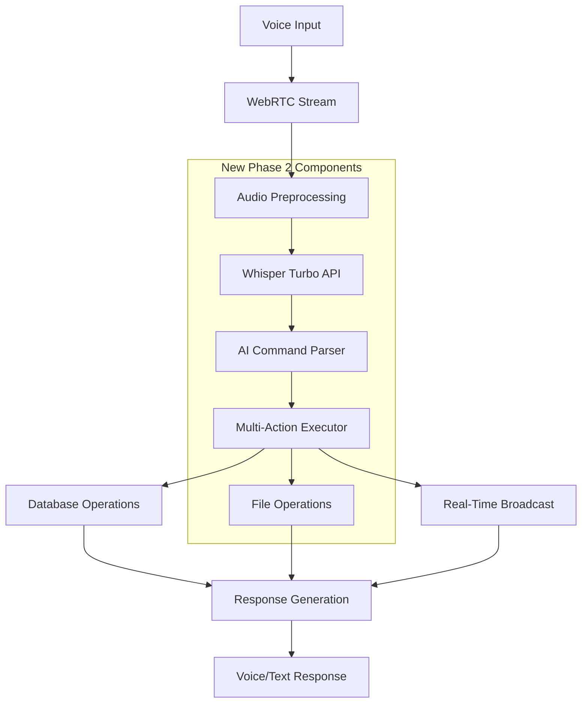

# Phase 2 Implementation Plan - Voice Core & AI Intelligence
## CEO Communication Platform Backend

### 🎯 Phase 2 Overview
**Duration**: Weeks 4-6  
**Status**: 📋 **PLANNING COMPLETE** - Ready for Implementation  
**Focus**: Voice Processing Pipeline, AI Integration, Multi-Action Commands

Phase 2 transforms the CEO Communication Platform from a traditional backend into an intelligent, voice-driven system capable of processing complex multi-step commands with <2 second response times.

---

## 🎙️ Phase 2 Core Objectives

### 🚀 Primary Goals
1. **Ultra-Fast Voice Processing Pipeline** - <2s end-to-end processing
2. **Advanced AI Agent Integration** - GPT-4 Turbo with organizational context
3. **Multi-Action Command System** - Execute complex workflows via single voice command
4. **Intelligent Context Management** - Smart entity resolution and temporal understanding
5. **Enterprise File Management** - AWS S3 integration with voice-driven uploads
6. **Advanced Real-Time Features** - Live command execution broadcasting

### 📊 Success Metrics
- Simple voice commands: <2 seconds end-to-end
- Complex multi-action commands: <5 seconds
- Voice recognition accuracy: >95%
- Command success rate: >98%
- Real-time sync latency: <100ms
- System supports 25+ concurrent users

---

## 🏗️ Phase 2 Architecture Overview



---

## 🎛️ Voice Processing Pipeline Implementation

### Audio Stream Management
```typescript
// WebRTC Audio Stream Handler
export class AudioStreamManager {
  private activeStreams: Map<string, AudioStream> = new Map();
  
  async initializeStream(userId: string, socketId: string): Promise<AudioStream> {
    const stream = new AudioStream({
      userId,
      socketId,
      sampleRate: 16000,
      channels: 1,
      format: 'pcm16',
      chunkSize: 1024
    });
    
    this.activeStreams.set(socketId, stream);
    return stream;
  }
  
  async processAudioChunk(
    socketId: string, 
    audioChunk: Buffer
  ): Promise<ProcessingResult> {
    const stream = this.activeStreams.get(socketId);
    if (!stream) throw new Error('Stream not found');
    
    // Real-time audio preprocessing
    const preprocessed = await this.preprocessAudio(audioChunk);
    stream.addChunk(preprocessed);
    
    // Voice Activity Detection
    const hasVoice = await this.detectVoiceActivity(preprocessed);
    if (!hasVoice) return { status: 'waiting' };
    
    // Check if speech segment is complete
    if (stream.isSegmentComplete()) {
      return this.processCompleteSegment(stream);
    }
    
    return { status: 'processing' };
  }
}
```

### Whisper Integration Service
```typescript
// OpenAI Whisper API Integration
export class WhisperService {
  private connectionPool: AxiosInstance[];
  private activeRequests: Map<string, AbortController> = new Map();
  
  constructor() {
    // Pre-warm connection pool for <2s response times
    this.connectionPool = Array.from({ length: 5 }, () => 
      axios.create({
        baseURL: 'https://api.openai.com/v1',
        headers: {
          'Authorization': `Bearer ${config.openai.apiKey}`,
          'Content-Type': 'multipart/form-data'
        },
        timeout: 10000,
        keepAlive: true
      })
    );
  }
  
  async transcribeAudio(audioBuffer: Buffer, language?: string): Promise<TranscriptResult> {
    const startTime = performance.now();
    const requestId = crypto.randomUUID();
    
    try {
      // Get available connection from pool
      const client = this.getAvailableClient();
      const abortController = new AbortController();
      this.activeRequests.set(requestId, abortController);
      
      // Prepare form data
      const formData = new FormData();
      formData.append('file', audioBuffer, {
        filename: 'audio.wav',
        contentType: 'audio/wav'
      });
      formData.append('model', 'whisper-1');
      if (language) formData.append('language', language);
      formData.append('response_format', 'verbose_json');
      
      const response = await client.post('/audio/transcriptions', formData, {
        signal: abortController.signal
      });
      
      const processingTime = performance.now() - startTime;
      
      return {
        transcript: response.data.text,
        confidence: response.data.segments?.[0]?.confidence || 0.9,
        language: response.data.language,
        processingTime,
        segments: response.data.segments
      };
      
    } catch (error) {
      throw new VoiceProcessingError('Transcription failed', error);
    } finally {
      this.activeRequests.delete(requestId);
    }
  }
}
```

---

## 🤖 AI Agent & Command Processing

### Advanced AI Command Parser
```typescript
// GPT-4 Turbo Integration for Command Analysis
export class AICommandParser {
  private openai: OpenAI;
  private contextManager: ContextManager;
  
  async parseVoiceCommand(
    transcript: string, 
    userContext: UserContext
  ): Promise<ParsedCommand> {
    const startTime = performance.now();
    
    // Build comprehensive context
    const context = await this.contextManager.buildContext(userContext);
    
    const systemPrompt = this.buildSystemPrompt(context);
    const userPrompt = this.buildUserPrompt(transcript, context);
    
    try {
      const response = await this.openai.chat.completions.create({
        model: 'gpt-4-turbo',
        messages: [
          { role: 'system', content: systemPrompt },
          { role: 'user', content: userPrompt }
        ],
        temperature: 0.1,
        max_tokens: 1000,
        response_format: { type: 'json_object' }
      });
      
      const parsed = JSON.parse(response.choices[0].message.content!);
      const processingTime = performance.now() - startTime;
      
      return {
        intent: parsed.intent,
        confidence: parsed.confidence,
        actions: parsed.actions,
        entities: parsed.entities,
        context: parsed.context,
        processingTime
      };
      
    } catch (error) {
      throw new AIProcessingError('Command parsing failed', error);
    }
  }
  
  private buildSystemPrompt(context: ContextData): string {
    return `You are an advanced AI assistant for a CEO communication platform.

CONTEXT:
- Organization: ${context.organization.name}
- Current User: ${context.user.name} (${context.user.role})
- Active Channels: ${context.activeChannels.map(c => c.name).join(', ')}
- Recent Tasks: ${context.recentTasks.slice(0, 3).map(t => t.title).join(', ')}
- Current Time: ${new Date().toISOString()}

CAPABILITIES:
You can execute these actions through voice commands:
1. CREATE_CHANNEL - Create new communication channels
2. CREATE_TASK - Create tasks with assignments and deadlines
3. ASSIGN_USERS - Assign tasks to team members
4. SEND_MESSAGE - Send messages to channels or users
5. UPLOAD_FILE - Upload and share files
6. SET_DEADLINE - Set or update task deadlines
7. CREATE_DEPENDENCY - Create task dependencies
8. UPDATE_STATUS - Update task or channel status
9. SCHEDULE_MEETING - Schedule meetings and events
10. GENERATE_REPORT - Generate reports and summaries

COMMAND ANALYSIS:
Parse the user's voice command and return a JSON object with:
{
  "intent": "primary intention of the command",
  "confidence": 0.95,
  "actions": [
    {
      "type": "ACTION_TYPE",
      "parameters": { "key": "value" },
      "priority": 1,
      "dependencies": []
    }
  ],
  "entities": {
    "users": [{"name": "John", "resolved_id": "uuid"}],
    "channels": [{"name": "marketing", "resolved_id": "uuid"}],
    "dates": [{"text": "Friday", "resolved_date": "2024-01-19"}]
  },
  "context": {
    "references": ["this", "that", "it"],
    "temporal_context": "next week",
    "implied_entities": []
  }
}

IMPORTANT: Always resolve entity references using the provided context.`;
  }
}
```

### Multi-Action Command Executor
```typescript
// Complex Command Execution Engine
export class MultiActionExecutor {
  private actionHandlers: Map<string, ActionHandler>;
  private dependencyResolver: DependencyResolver;
  
  async executeCommand(parsedCommand: ParsedCommand): Promise<ExecutionResult> {
    const executionPlan = await this.createExecutionPlan(parsedCommand.actions);
    const results: ActionResult[] = [];
    
    try {
      // Start database transaction for atomic execution
      return await this.db.transaction(async (tx) => {
        for (const step of executionPlan.steps) {
          if (step.parallel) {
            // Execute parallel actions
            const parallelResults = await Promise.allSettled(
              step.actions.map(action => this.executeAction(action, tx))
            );
            results.push(...this.processParallelResults(parallelResults));
          } else {
            // Execute sequential actions
            for (const action of step.actions) {
              const result = await this.executeAction(action, tx);
              results.push(result);
              
              // Check if action failed and should abort
              if (!result.success && action.critical) {
                throw new ExecutionError('Critical action failed', result.error);
              }
            }
          }
        }
        
        // Broadcast all changes in real-time
        await this.broadcastExecutionResults(results);
        
        return {
          success: true,
          totalActions: results.length,
          successfulActions: results.filter(r => r.success).length,
          results,
          executionTime: performance.now() - executionPlan.startTime
        };
      });
      
    } catch (error) {
      // Rollback handled by transaction
      return {
        success: false,
        error: error.message,
        results,
        rollbackApplied: true
      };
    }
  }
}
```

---

## 📁 Enterprise File Management System

### AWS S3 Integration Service
```typescript
// S3 File Management with Voice Integration
export class S3FileService {
  private s3Client: S3Client;
  private uploadManager: UploadManager;
  
  constructor() {
    this.s3Client = new S3Client({
      region: config.aws.region,
      credentials: {
        accessKeyId: config.aws.accessKeyId,
        secretAccessKey: config.aws.secretAccessKey
      }
    });
    
    this.uploadManager = new UploadManager({
      client: this.s3Client,
      partSize: 1024 * 1024 * 10, // 10MB chunks
      queueSize: 4,
      leavePartsOnError: false
    });
  }
  
  async uploadFileViaVoice(
    voiceCommand: VoiceFileUpload
  ): Promise<FileUploadResult> {
    try {
      // Generate secure upload URL
      const uploadUrl = await this.generatePresignedUploadUrl({
        bucket: config.aws.s3Bucket,
        key: `uploads/${voiceCommand.userId}/${Date.now()}-${voiceCommand.fileName}`,
        contentType: voiceCommand.contentType,
        metadata: {
          uploadedBy: voiceCommand.userId,
          originalCommand: voiceCommand.transcript,
          channels: voiceCommand.targetChannels?.join(',') || '',
          description: voiceCommand.description || ''
        }
      });
      
      // Create database record
      const fileRecord = await this.sharedResourceRepository.create({
        name: voiceCommand.fileName,
        description: voiceCommand.description,
        resource_type: this.determineResourceType(voiceCommand.contentType),
        content_url: uploadUrl.finalUrl,
        file_size: voiceCommand.fileSize,
        mime_type: voiceCommand.contentType,
        uploaded_by: voiceCommand.userId,
        metadata: {
          s3_key: uploadUrl.key,
          upload_method: 'voice_command',
          command_transcript: voiceCommand.transcript
        }
      });
      
      // Auto-link to specified channels/tasks
      if (voiceCommand.targetChannels?.length) {
        await this.linkFileToEntities(fileRecord.id, voiceCommand.targetChannels);
      }
      
      return {
        success: true,
        fileId: fileRecord.id,
        uploadUrl: uploadUrl.signedUrl,
        finalUrl: uploadUrl.finalUrl,
        expiresAt: uploadUrl.expiresAt
      };
      
    } catch (error) {
      throw new FileUploadError('Voice-driven file upload failed', error);
    }
  }
  
  async handleFileUploadComplete(
    fileId: string, 
    s3Event: S3Event
  ): Promise<void> {
    // Update file record with final details
    await this.sharedResourceRepository.update(fileId, {
      file_size: s3Event.size,
      content_url: s3Event.url,
      metadata: {
        ...await this.sharedResourceRepository.findById(fileId).metadata,
        s3_etag: s3Event.etag,
        upload_completed_at: new Date().toISOString()
      }
    });
    
    // Broadcast file availability to relevant channels
    const fileRecord = await this.sharedResourceRepository.findById(fileId);
    const linkedEntities = await this.resourceLinkRepository.findByResource(fileId);
    
    for (const link of linkedEntities) {
      await this.socketManager.emitToRoom(
        `${link.entity_type}:${link.entity_id}`,
        'file:uploaded',
        {
          file: fileRecord,
          uploadedBy: fileRecord.uploaded_by,
          timestamp: new Date().toISOString()
        }
      );
    }
  }
}
```

### Voice-Driven File Operations
```typescript
// File operation commands via voice
export class VoiceFileOperations {
  async processFileCommand(command: ParsedFileCommand): Promise<FileOperationResult> {
    switch (command.operation) {
      case 'UPLOAD':
        return this.handleUploadCommand(command);
      case 'SHARE':
        return this.handleShareCommand(command);
      case 'ORGANIZE':
        return this.handleOrganizeCommand(command);
      case 'DELETE':
        return this.handleDeleteCommand(command);
      default:
        throw new UnsupportedOperationError(`Operation ${command.operation} not supported`);
    }
  }
  
  private async handleUploadCommand(command: ParsedFileCommand): Promise<FileOperationResult> {
    // Example: "Upload the brand guidelines to the marketing and design channels"
    const uploadRequest: VoiceFileUpload = {
      userId: command.userId,
      fileName: command.entities.fileName,
      contentType: command.entities.fileType || 'application/pdf',
      description: command.entities.description,
      targetChannels: command.entities.channels.map(c => c.resolved_id),
      transcript: command.originalTranscript
    };
    
    const uploadResult = await this.s3FileService.uploadFileViaVoice(uploadRequest);
    
    return {
      success: true,
      operation: 'UPLOAD',
      result: {
        message: `File upload ready. Please upload "${command.entities.fileName}" using the provided link.`,
        uploadUrl: uploadResult.uploadUrl,
        fileId: uploadResult.fileId,
        linkedChannels: command.entities.channels.map(c => c.name)
      }
    };
  }
}
```

---

## 🧠 Intelligent Context Management

### Advanced Context Manager
```typescript
// Context-Aware AI System
export class ContextManager {
  private conversationHistory: ConversationHistory;
  private entityResolver: EntityResolver;
  private temporalProcessor: TemporalProcessor;
  
  async buildContext(userContext: UserContext): Promise<ContextData> {
    const [
      organizationContext,
      conversationContext,
      entityContext,
      temporalContext
    ] = await Promise.all([
      this.getOrganizationContext(userContext.organizationId),
      this.getConversationHistory(userContext.userId),
      this.getEntityContext(userContext),
      this.getTemporalContext()
    ]);
    
    return {
      organization: organizationContext,
      user: userContext,
      conversation: conversationContext,
      entities: entityContext,
      temporal: temporalContext,
      timestamp: new Date().toISOString()
    };
  }
  
  async resolveEntityReferences(
    transcript: string, 
    context: ContextData
  ): Promise<ResolvedEntities> {
    const references = this.extractReferences(transcript);
    const resolved: ResolvedEntities = {
      users: [],
      channels: [],
      tasks: [],
      files: [],
      dates: []
    };
    
    // Resolve pronouns and implicit references
    for (const ref of references.pronouns) {
      const entity = await this.resolvePronoun(ref, context);
      if (entity) {
        resolved[entity.type].push(entity);
      }
    }
    
    // Resolve named entities
    for (const ref of references.namedEntities) {
      const entities = await this.resolveNamedEntity(ref, context);
      entities.forEach(entity => {
        resolved[entity.type].push(entity);
      });
    }
    
    // Resolve temporal references
    for (const ref of references.temporalRefs) {
      const date = await this.temporalProcessor.resolveDate(ref, context.temporal);
      if (date) {
        resolved.dates.push({
          original: ref,
          resolved: date.toISOString(),
          confidence: date.confidence
        });
      }
    }
    
    return resolved;
  }
}
```

### Smart Entity Resolution
```typescript
// Entity Resolution with Fuzzy Matching
export class EntityResolver {
  async resolveUser(name: string, context: ContextData): Promise<ResolvedUser | null> {
    // Try exact match first
    let user = await this.userRepository.findByName(name);
    if (user) return { ...user, confidence: 1.0 };
    
    // Try fuzzy matching
    const allUsers = await this.userRepository.findAll();
    const matches = this.fuzzyMatcher.match(name, allUsers.map(u => u.name));
    
    if (matches.length > 0 && matches[0].score > 0.8) {
      user = allUsers.find(u => u.name === matches[0].value);
      return { ...user!, confidence: matches[0].score };
    }
    
    // Try role-based resolution
    const roleMatch = await this.resolveByRole(name, context);
    if (roleMatch) return roleMatch;
    
    return null;
  }
  
  async resolveChannel(name: string, context: ContextData): Promise<ResolvedChannel | null> {
    // Context-aware channel resolution
    const userChannels = await this.channelRepository.findByMember(context.user.id);
    
    // Try exact match within user's channels
    let channel = userChannels.find(c => 
      c.name.toLowerCase() === name.toLowerCase()
    );
    if (channel) return { ...channel, confidence: 1.0 };
    
    // Try fuzzy match within user's channels
    const matches = this.fuzzyMatcher.match(
      name, 
      userChannels.map(c => c.name)
    );
    
    if (matches.length > 0 && matches[0].score > 0.7) {
      channel = userChannels.find(c => c.name === matches[0].value);
      return { ...channel!, confidence: matches[0].score };
    }
    
    return null;
  }
}
```

---

## ⚡ Real-Time Command Execution Broadcasting

### Live Execution Streaming
```typescript
// Real-Time Command Execution Broadcasting
export class CommandExecutionBroadcaster {
  async broadcastCommandExecution(
    command: ParsedCommand,
    execution: ExecutionPlan
  ): Promise<void> {
    const broadcastData = {
      commandId: command.id,
      userId: command.userId,
      transcript: command.transcript,
      executionPlan: execution,
      startTime: new Date().toISOString()
    };
    
    // Broadcast to all affected entities
    const affectedUsers = await this.getAffectedUsers(execution);
    const affectedChannels = await this.getAffectedChannels(execution);
    
    // Real-time execution progress
    for (const step of execution.steps) {
      await this.broadcastStepStart(step, affectedUsers, affectedChannels);
      
      // Execute step and broadcast results
      const stepResults = await this.executeStep(step);
      await this.broadcastStepComplete(step, stepResults, affectedUsers, affectedChannels);
    }
    
    // Final execution summary
    await this.broadcastExecutionComplete(command, execution, affectedUsers, affectedChannels);
  }
  
  private async broadcastStepStart(
    step: ExecutionStep,
    users: string[],
    channels: string[]
  ): Promise<void> {
    const stepData = {
      stepId: step.id,
      actions: step.actions.map(a => ({
        type: a.type,
        description: this.getActionDescription(a)
      })),
      status: 'starting',
      timestamp: new Date().toISOString()
    };
    
    // Broadcast to affected users
    users.forEach(userId => {
      this.socketManager.emitToUser(userId, 'command:step_start', stepData);
    });
    
    // Broadcast to affected channels
    channels.forEach(channelId => {
      this.socketManager.emitToRoom(`channel:${channelId}`, 'command:step_start', stepData);
    });
  }
  
  private async broadcastStepComplete(
    step: ExecutionStep,
    results: ActionResult[],
    users: string[],
    channels: string[]
  ): Promise<void> {
    const stepData = {
      stepId: step.id,
      status: 'completed',
      results: results.map(r => ({
        success: r.success,
        data: r.data,
        error: r.error?.message
      })),
      timestamp: new Date().toISOString()
    };
    
    // Broadcast step completion
    users.forEach(userId => {
      this.socketManager.emitToUser(userId, 'command:step_complete', stepData);
    });
    
    channels.forEach(channelId => {
      this.socketManager.emitToRoom(`channel:${channelId}`, 'command:step_complete', stepData);
    });
    
    // Broadcast specific entity updates
    for (const result of results) {
      if (result.success && result.data) {
        await this.broadcastEntityUpdate(result);
      }
    }
  }
}
```

---

## 📊 Performance Optimization Strategy

### Connection Pool Management
```typescript
// Optimized connection management for <2s response times
export class ConnectionManager {
  private whisperConnections: AxiosInstance[];
  private openaiConnections: OpenAI[];
  private s3Connections: S3Client[];
  
  constructor() {
    // Pre-warm API connections
    this.initializeConnectionPools();
    this.startConnectionMonitoring();
  }
  
  private initializeConnectionPools(): void {
    // Whisper API connections (5 pre-warmed)
    this.whisperConnections = Array.from({ length: 5 }, () =>
      axios.create({
        baseURL: 'https://api.openai.com/v1',
        timeout: 8000,
        keepAlive: true,
        headers: {
          'Authorization': `Bearer ${config.openai.apiKey}`,
          'Keep-Alive': 'timeout=30, max=100'
        }
      })
    );
    
    // OpenAI Chat API connections (3 pre-warmed)
    this.openaiConnections = Array.from({ length: 3 }, () =>
      new OpenAI({
        apiKey: config.openai.apiKey,
        timeout: 10000,
        maxRetries: 2
      })
    );
    
    // AWS S3 connections (2 pre-warmed)
    this.s3Connections = Array.from({ length: 2 }, () =>
      new S3Client({
        region: config.aws.region,
        credentials: {
          accessKeyId: config.aws.accessKeyId,
          secretAccessKey: config.aws.secretAccessKey
        },
        requestHandler: {
          connectionTimeout: 5000,
          socketTimeout: 10000
        }
      })
    );
  }
}
```

### Caching Strategy for Voice Commands
```typescript
// Advanced caching for voice processing
export class VoiceProcessingCache {
  private transcriptCache: Redis; // Cache transcripts for similar audio
  private contextCache: Redis;    // Cache user context data
  private entityCache: Redis;     // Cache resolved entities
  
  async getCachedTranscript(audioHash: string): Promise<string | null> {
    const cached = await this.transcriptCache.get(`transcript:${audioHash}`);
    if (cached) {
      // Extend TTL on cache hit
      await this.transcriptCache.expire(`transcript:${audioHash}`, 3600);
      return cached;
    }
    return null;
  }
  
  async cacheTranscript(audioHash: string, transcript: string): Promise<void> {
    await this.transcriptCache.setex(
      `transcript:${audioHash}`, 
      3600, // 1 hour TTL
      transcript
    );
  }
  
  async getCachedContext(userId: string): Promise<ContextData | null> {
    const cached = await this.contextCache.get(`context:${userId}`);
    if (cached) {
      const context = JSON.parse(cached);
      // Check if context is still fresh (< 5 minutes)
      if (Date.now() - new Date(context.timestamp).getTime() < 300000) {
        return context;
      }
    }
    return null;
  }
}
```

---

## 🧪 Phase 2 Testing Strategy

### Voice Processing Tests
```typescript
// Comprehensive voice processing test suite
describe('Voice Processing Pipeline', () => {
  describe('Audio Stream Processing', () => {
    it('should process audio chunks in real-time', async () => {
      const audioStream = new MockAudioStream();
      const processor = new AudioStreamManager();
      
      const result = await processor.processAudioChunk('socket-1', audioChunk);
      
      expect(result.status).toBe('processing');
      expect(result.processingTime).toBeLessThan(100); // <100ms
    });
    
    it('should detect voice activity accurately', async () => {
      const silentChunk = generateSilentAudio(1024);
      const voiceChunk = generateVoiceAudio(1024);
      
      const silentResult = await processor.detectVoiceActivity(silentChunk);
      const voiceResult = await processor.detectVoiceActivity(voiceChunk);
      
      expect(silentResult).toBe(false);
      expect(voiceResult).toBe(true);
    });
  });
  
  describe('Whisper Integration', () => {
    it('should transcribe audio within 2 seconds', async () => {
      const audioBuffer = await loadTestAudio('sample-command.wav');
      const startTime = performance.now();
      
      const result = await whisperService.transcribeAudio(audioBuffer);
      const duration = performance.now() - startTime;
      
      expect(duration).toBeLessThan(2000);
      expect(result.confidence).toBeGreaterThan(0.9);
      expect(result.transcript).toContain('create channel');
    });
  });
  
  describe('AI Command Parsing', () => {
    it('should parse complex multi-action commands', async () => {
      const command = 'Create marketing channel, add Sarah and Mike, create task for campaign launch due Friday';
      
      const parsed = await aiParser.parseVoiceCommand(command, mockContext);
      
      expect(parsed.actions).toHaveLength(4); // Create channel, add users x2, create task
      expect(parsed.actions[0].type).toBe('CREATE_CHANNEL');
      expect(parsed.actions[3].type).toBe('CREATE_TASK');
      expect(parsed.entities.users).toHaveLength(2);
    });
  });
});
```

### Integration Tests for Multi-Action Commands
```typescript
// End-to-end voice command integration tests
describe('Multi-Action Command Integration', () => {
  it('should execute complex project setup command', async () => {
    const voiceCommand = `
      Create a product launch project with marketing and development channels.
      Add Sarah to marketing, Mike to development.
      Create tasks: marketing materials due Friday assigned to Sarah,
      development testing due Thursday assigned to Mike.
      Make testing block marketing materials.
      Upload project requirements to both channels.
    `;
    
    const result = await voiceCommandProcessor.processCommand(voiceCommand, {
      userId: testUser.id,
      organizationId: testOrg.id
    });
    
    // Verify all actions executed successfully
    expect(result.success).toBe(true);
    expect(result.totalActions).toBe(8);
    expect(result.successfulActions).toBe(8);
    
    // Verify entities were created
    const channels = await channelRepository.findByCreator(testUser.id);
    expect(channels).toHaveLength(2);
    expect(channels.map(c => c.name)).toContain('Marketing');
    expect(channels.map(c => c.name)).toContain('Development');
    
    const tasks = await taskRepository.findByCreator(testUser.id);
    expect(tasks).toHaveLength(2);
    
    // Verify task dependencies
    const dependencies = await taskRepository.findDependencies(tasks[0].id);
    expect(dependencies).toHaveLength(1);
  });
  
  it('should handle partial command failures gracefully', async () => {
    const voiceCommand = `
      Create channel for invalid-user@domain,
      add non-existent user to channel,
      create task assigned to valid user
    `;
    
    const result = await voiceCommandProcessor.processCommand(voiceCommand, mockContext);
    
    // Should fail gracefully without corrupting data
    expect(result.success).toBe(false);
    expect(result.rollbackApplied).toBe(true);
    
    // Verify no partial data was created
    const channels = await channelRepository.findByCreator(mockContext.userId);
    expect(channels).toHaveLength(0);
  });
});
```

---

## 🔒 Security Considerations for Phase 2

### Voice Command Security
```typescript
// Security measures for voice commands
export class VoiceSecurityManager {
  async validateVoiceCommand(
    command: ParsedCommand,
    user: User
  ): Promise<SecurityValidationResult> {
    const validations = await Promise.all([
      this.validateUserPermissions(command, user),
      this.validateCommandComplexity(command),
      this.validateEntityAccess(command, user),
      this.validateRateLimit(user.id),
      this.scanForMaliciousContent(command)
    ]);
    
    const failed = validations.filter(v => !v.passed);
    
    return {
      passed: failed.length === 0,
      failures: failed,
      riskScore: this.calculateRiskScore(validations)
    };
  }
  
  private async validateUserPermissions(
    command: ParsedCommand,
    user: User
  ): Promise<ValidationResult> {
    for (const action of command.actions) {
      const requiredPermission = this.getRequiredPermission(action.type);
      const hasPermission = await this.authService.hasPermission(
        user.id, 
        requiredPermission
      );
      
      if (!hasPermission) {
        return {
          passed: false,
          reason: `Insufficient permissions for action: ${action.type}`,
          severity: 'high'
        };
      }
    }
    
    return { passed: true };
  }
  
  private async scanForMaliciousContent(
    command: ParsedCommand
  ): Promise<ValidationResult> {
    // Scan for potentially malicious patterns
    const maliciousPatterns = [
      /delete\s+all/i,
      /drop\s+table/i,
      /truncate/i,
      /remove\s+everyone/i
    ];
    
    const transcript = command.transcript.toLowerCase();
    const suspiciousPattern = maliciousPatterns.find(pattern => 
      pattern.test(transcript)
    );
    
    if (suspiciousPattern) {
      return {
        passed: false,
        reason: 'Potentially malicious command detected',
        severity: 'critical',
        pattern: suspiciousPattern.source
      };
    }
    
    return { passed: true };
  }
}
```

---

## 📈 Monitoring & Analytics for Phase 2

### Voice Processing Analytics
```typescript
// Comprehensive voice processing metrics
export class VoiceAnalytics {
  async recordVoiceCommand(
    command: ParsedCommand,
    execution: ExecutionResult
  ): Promise<void> {
    const metrics = {
      commandId: command.id,
      userId: command.userId,
      transcript: command.transcript,
      transcriptLength: command.transcript.length,
      confidence: command.confidence,
      processingTime: command.processingTime,
      actionCount: command.actions.length,
      executionTime: execution.executionTime,
      success: execution.success,
      timestamp: new Date()
    };
    
    // Store detailed metrics
    await this.analyticsRepository.recordVoiceCommand(metrics);
    
    // Update real-time metrics
    await this.updateRealTimeMetrics(metrics);
    
    // Check for performance alerts
    if (metrics.processingTime > 2000) {
      await this.alertService.sendPerformanceAlert(
        'Voice processing exceeded 2 second target',
        metrics
      );
    }
  }
  
  async generateVoiceInsights(
    userId: string,
    timeRange: DateRange
  ): Promise<VoiceInsights> {
    const commands = await this.analyticsRepository.getVoiceCommands(
      userId,
      timeRange
    );
    
    return {
      totalCommands: commands.length,
      averageProcessingTime: this.calculateAverage(commands, 'processingTime'),
      successRate: this.calculateSuccessRate(commands),
      mostUsedCommands: this.analyzeMostUsedCommands(commands),
      performanceTrends: this.analyzePerformanceTrends(commands),
      accuracyTrends: this.analyzeAccuracyTrends(commands)
    };
  }
}
```

---

## 🚀 Phase 2 Implementation Roadmap

### Week 4: Voice Processing Foundation
- **Days 1-2**: Audio stream management and WebRTC integration
- **Days 3-4**: Whisper API integration and connection pooling  
- **Days 5-7**: Basic voice-to-text pipeline with <2s target

### Week 5: AI Integration & Multi-Action Commands
- **Days 1-2**: GPT-4 integration and command parsing
- **Days 3-4**: Multi-action executor and dependency resolution
- **Days 5-7**: Context management and entity resolution

### Week 6: File Management & Real-Time Features
- **Days 1-2**: AWS S3 integration and voice-driven file uploads
- **Days 3-4**: Real-time command execution broadcasting
- **Days 5-7**: Performance optimization and testing

---

## 🎯 Phase 2 Success Criteria

### ✅ Performance Benchmarks
- [ ] Simple voice commands: <2 seconds end-to-end
- [ ] Complex multi-action commands: <5 seconds  
- [ ] Voice recognition accuracy: >95%
- [ ] Command success rate: >98%
- [ ] Real-time synchronization: <100ms
- [ ] System supports 25+ concurrent users

### ✅ Feature Completeness
- [ ] Voice processing pipeline operational
- [ ] Multi-action command system functional
- [ ] Context-aware entity resolution working
- [ ] File upload via voice commands
- [ ] Real-time execution broadcasting
- [ ] Performance optimization implemented

### ✅ Integration Success  
- [ ] OpenAI Whisper integration working
- [ ] GPT-4 command parsing functional
- [ ] AWS S3 file management operational
- [ ] Real-time WebSocket broadcasting
- [ ] Database transaction handling
- [ ] Error recovery and rollback system

---

**Phase 2 Status**: 📋 **READY FOR IMPLEMENTATION**  
**Dependencies**: Phase 1 infrastructure completed  
**Timeline**: 3 weeks (Weeks 4-6)  
**Team Required**: 2-3 backend developers, 1 DevOps engineer  
**Success Definition**: Voice-driven CEO communication platform with <2s response times and >95% accuracy